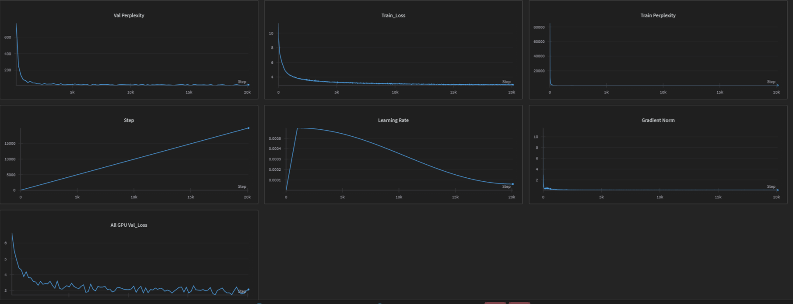

# StoryMixtral - Mixtral Inspired Model

A PyTorch implementation of a Mixtral inspired transformer model with Mixture of Experts (MoE), Flash Attention, and other advanced features.

## Examples

Provided under the `generated_data/` directory, these examples showcase the model's capabilities in text generation and understanding.



## 📊 Training Results & Model Weights

**📈 View Training Report**: [StoryMixtral Training Results on WandB](https://wandb.ai/rentio/Mixtral-DDP-Pretrain-10-billion-tokens/reports/StoryMixtral--VmlldzoxMzYyNzc0OQ?accessToken=nybd4lxybsbq5k5fh2dqjcucdawilt3fossn583wv6jiu8tbdzcybiihe7rhsqmq)

**💾 Download Pre-trained Weights**: 
- **Hugging Face Model**: [YuvrajSingh9886/StoryMixtral](https://huggingface.co/YuvrajSingh9886/StoryMixtral)
- **WandB Checkpoints**: Check the WandB report above for additional trained model checkpoints

## Features

- **Flash Attention**: Efficient attention mechanism with memory optimization
- **Mixture of Experts (MoE)**: 8 experts with top-2 routing and noisy top-k support
- **SWiGLU Activation**: Advanced activation function in expert layers
- **Rotary Positional Embeddings**: Position encoding for sequence understanding
- **Liger Kernels**: Optimized kernels for faster training (optional)
- **Distributed Training**: Support for multi-GPU training with DDP
- **Advanced Optimizer**: AdamW optimizer with custom learning rate scheduling
- **Gradio Interface**: Interactive web interface for text generation

## Model Architecture

### Default Configuration
- **Embedding Dimensions**: 512
- **Decoder Layers**: 8
- **Attention Heads**: 8
- **MoE Experts**: 8 (top-2 routing)
- **Block Size**: 1024 tokens
- **Vocabulary Size**: Based on Llama-2-7b tokenizer (~32,000 tokens)
- **Batch Size**: 16

### Full Parameter List

#### Model Architecture Parameters
- `epochs`: Number of training epochs (default: 4)
- `block_size`: Maximum sequence length (default: 1024)
- `batch_size`: Training batch size (default: 16)
- `embeddings_dims`: Model embedding dimensions (default: 512)
- `no_of_heads`: Number of attention heads (default: 8)
- `no_of_decoder_layers`: Number of decoder layers (default: 8)
- `attn_dropout`: Attention dropout rate (default: 0.1)
- `dropout`: General dropout rate (default: 0.1)

#### Mixture of Experts (MoE) Parameters
- `experts`: Number of MoE experts (default: 8)
- `top_experts`: Number of experts to route to (default: 2)
- `noisy_topk`: Use noisy top-k routing (default: False)

#### Training Hyperparameters
- `max_lr`: Maximum learning rate (default: 6e-4)
- `weight_decay_optim`: Weight decay for optimizer (default: 0.01)
- `beta_1`: Beta1 for optimizer (default: 0.9)
- `beta_2`: Beta2 for optimizer (default: 0.95)
- `eps`: Epsilon for optimizer (default: 1e-8)
- `clip`: Gradient clipping value (default: 1.0)

#### System Configuration
- `device`: Device to use (default: 'cuda:9')
- `use_checkpointing`: Use gradient checkpointing (default: False)
- `use_liger`: Use Liger kernels for optimization (default: True)
- `use_flash_attention`: Use Flash Attention (default: True)
- `use_compile`: Use torch.compile (default: True)

#### Data Configuration
- `vocab_size`: Vocabulary size (default: based on tokenizer + 768)
- `val_epochs`: Validation frequency (default: 2)

## Quick Start

### Installation

```bash
chmod +x install.sh
./install.sh
```

### Important: Hugging Face Token Setup

Since this model uses the Llama-2 tokenizer, you'll need a Hugging Face token to access the gated model. 

1. **Get a Hugging Face Token:**
   - Go to [Hugging Face Settings](https://huggingface.co/settings/tokens)
   - Create a new token with "Read" permissions
   - Accept the Llama-2 license at [meta-llama/Llama-2-7b-hf](https://huggingface.co/meta-llama/Llama-2-7b-hf)

2. **Set your token in config.py:**
   ```python
   TOKEN = 'your_token_here'
   ```

### Using Pre-trained Weights

1. **Download Model Weights**: 
   - **Option 1**: Download from [Hugging Face - YuvrajSingh9886/StoryMixtral](https://huggingface.co/YuvrajSingh9886/StoryMixtral)
   - **Option 2**: Visit the [WandB Training Report](https://wandb.ai/rentio/Mixtral-DDP-Pretrain-10-billion-tokens) for additional checkpoints
   - Place downloaded files in the `checkpoints/` directory

2. **Load Pre-trained Model for Inference**:
   ```bash
   # Using the Gradio web interface
   cd gradio
   python app.py
   
   # Or use in your own code
   python inference.py
   ```

### Training Examples

#### Basic Training (Single GPU)
```bash
python trainer.py
```

#### Training with Custom Parameters
```bash
# Train with larger model (modify config.py)
python trainer.py

# Train with different dataset (modify data.py)
python trainer.py
```

#### Multi-GPU Distributed Training
```bash
# 2 GPUs
torchrun --nproc_per_node=2 trainer.py

# 4 GPUs
torchrun --nproc_per_node=4 trainer.py

# 8 GPUs
torchrun --nproc_per_node=8 trainer.py
```

### Inference with Gradio

**HF_TOKEN** should be set in `config.py` to use the Gradio interface. Moreover, set your token as follows:

```python
 export HF_TOKEN=<TOKEN_HERE>
```


```bash
# Run the Gradio app
cd gradio
python app.py

# With custom checkpoint (edit app.py to point to your checkpoint)
cd gradio
python app.py
```

## File Structure

```
StoryMixtral/
├── config.py          # Model configuration and hyperparameters
├── model.py           # Model architecture (Mixtral, MoE, Attention, etc.)
├── data.py           # Data loading and preparation
├── inference.py      # Inference functions and text generation
├── trainer.py        # Main training loop with DDP support
├── install.sh        # Setup script
├── requirements.txt  # Python dependencies
├── model_summary.py  # Model architecture summary
├── gradio/
│   └── app.py        # Gradio web interface
├── checkpoints/      # Model checkpoints
├── generated_data/   # Generated text outputs
├── images/           # Project images
└── old/             # Original files
```


## Training Features

- **Gradient Accumulation**: Configurable batch size scaling
- **Learning Rate Scheduling**: Cosine decay with warmup
- **Gradient Clipping**: Prevents gradient explosion
- **Wandb Integration**: Experiment tracking and logging
- **Checkpointing**: Regular model checkpoints during training
- **Loss Calculation**: Optimized cross-entropy with padding token handling
- **Distributed Training**: Multi-GPU support with DDP
- **Memory Optimization**: Gradient checkpointing support

## Generation Methods

1. **Top-k Sampling**: Traditional sampling with temperature control

## Advanced Usage

### Configuration
All parameters can be configured by modifying `config.py`:

```python
@dataclass
class ModelArgs:
    epochs = 4
    block_size = 1024
    batch_size = 16
    embeddings_dims = 512
    # ... other parameters
```

### Custom Dataset Training
Modify `data.py` to use different datasets:
```python
# TinyStories (default)
tinystories = True
fw = False

# FineWeb
tinystories = False
fw = True
```

### Monitoring and Logging
Training automatically logs to WandB with project name "Mixtral-DDP-Pretrain-10-billion-tokens"

## Performance Tips

1. **Use Liger Kernels**: Keep `use_liger = True` for optimized operations
2. **Flash Attention**: Keep `use_flash_attention = True` for memory efficiency
3. **Gradient Checkpointing**: Use `use_checkpointing = True` for memory-constrained setups
4. **Batch Size Tuning**: Start with smaller batch sizes and increase gradually
5. **Block Size**: Larger block sizes improve quality but require more memory

## Troubleshooting

### Common Issues

#### Authentication Error (401)
```bash
# Make sure you have accepted the Llama-2 license and have a valid token
# Visit: https://huggingface.co/meta-llama/Llama-2-7b-hf
# Then set your token in config.py
```

#### Out of Memory (OOM)
```python
# Reduce batch size and enable checkpointing in config.py
batch_size = 8
use_checkpointing = True
```

#### Slow Training
```python
# Enable optimizations in config.py
use_liger = True
use_flash_attention = True
use_compile = True
```

## Contributing

Feel free to contribute improvements, bug fixes, or new features!

## Requirements

- Python 3.8+
- PyTorch 2.0+
- Transformers
- Datasets
- Gradio
- Wandb
- Liger-kernel (optional)

## License

MIT License
